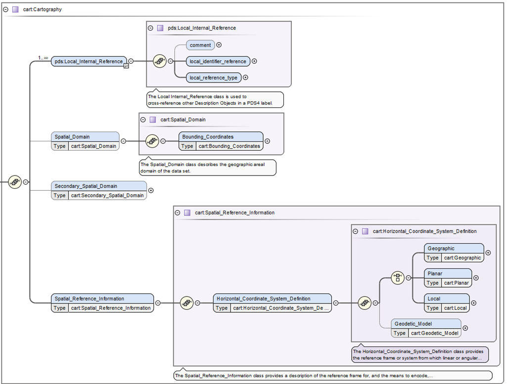

# Classes

## \<Spatial_Domain> and \<cart:Secondary_Spatial_Domain>

Within Figure 1, \<cart:Spatial_Domain> is required and lists the bounding box in degrees (longitude and latitude ranges). While this may become optional, with the introduction of ring map projections, which do not map into a latitude and longitude system, these values can simply be defined with zeros or nil. The \<cart:Secondary_Spatial_Domain> was added to assist when a data provider would like to support the bounding degrees in two different systems (e.g. Positive East Longitudes and Positive West Longitudes). Generally Positive East Longitudes are better supported in modern mapping applications, whereas, Positive West Longitudes are needed to support historical uses for example in previous archives or research publications. The IAU allows both systems, but highly recommends using the system historically used in past publications. _(add in more about East/West)._ 

>_Figure 1. The is the top level of the cartography data dictionary._

## \<Spatial_Reference_Information>

Within Figure 1 is \<cart:Spatial_Reference_Information> which defines the bulk of the information for the cartography data dictionary. Traversing down the next branch you will only find the horizontal coordinate system definition.

## \<Horizontal_Coordinate_System_Definition>

Also within Figure 1 is \<cart:Horizontal_Coordinate_System_Definition> which defines the four allowable horizontal system definitions. One branch requires one and only one type of \<cart:Geographic>, \<cart:Planar>, or \<cart:Local>. While the second branch defines \<cart:Geodetic_Model>, which defines the size of the target body (via the three radii attributes \<cart:a_axis_radius> (also called the semi-major axis), \<cart:b_axis_radius>, \<cart:c_axis_radius> (also called the polar-radius or semi-minor axis). If the target body is defined as a sphere, which is common for cartographic products defined a triaxial body , all three radii values will be the same. Lastly, while \<cart:Geodetic_Model> is generally required, it may be considered optional if the projection used is for a landed or rings data product.

## \<Geographic>

The \<cart:Geographic> class is only intended for image products and provides a location to define the pixel (or cell) size in angular degrees (using the attributes \<cart:latitude_resolution> and \<cart:longitude_resolution>). This horizontal system is strictly not a map projection although it resembles the same shape as the map projection Equirectangular (or Simple Cylindrical). And although the class is defined as defined as “geographic” it can hold geocentric pixel sizes. The type of system used, geographic or geocentric, is defined within \<cart:Geodetic_Model>.

## \<Planar>

The \<cart:Planar> will characteristically be the most widely-used horizontal type since it defines twelve typical cartographic map projections (including projections like Equirectangular, Sinusoidal, Polar Stereographic, etc.).  From the original [FGDC specification](https://www.fgdc.gov/csdgmgraphical/spref/horiz/planar.htm), Planar is confusingly defined as “The quantities of distances, or distances and angles, which define the position of a point on a reference plane to which the surface of the [target body] has been projected.”  In practice, this simply means the resulting transformation from the target body will be to a simple Cartesian coordinate system or “plane” in meters. Other units could be used, but within PDS4, the Cartesian X,Y axes will be in meters. 

## \<Local>

The \<cart:Local> provides a description of any coordinate system not necessarily aligned with the surface of the target body. As such, it provides a location for the seven landed map projections and the one currently supported ring map projection (Ring_Polar).

# [Attribute Definitions](#attributes)

## \<upperleft_corner_x> and \<upperleft_corner_y>

As stated above, there are 58 classes and 154 attributes within the cartography data dictionary. Here we will only list the critical definitions. Please see the cartography schema for the remainder of the definitions.

One of the largest causes of issues in PDS3 archives was the not understanding how to define the pixel offsets which registers or spatially locates the image array (plane in pixels) to the Cartesian plane in meters. These new attributes provide the projection offsets in X and Y in meters, relative to the map projection origin, at sample 0.5 and line 0.5 (upper left corner of pixel 1,1 within image array).

          (0.5,0.5) - upper left corner (edge) of pixel 1,1
         /
        #---+---+->  X axis
        | * |   |             
        +---+---+     
        |        \ 
      Y axis      pixel coordinate (2.5,1.5)
      
 where # is X,Y location in meters relative to map projection origin
       and the location for \<cart:upperleft_corner_x>, \<cart:upperleft_corner_y>.
 where * is pixel coordinate (1.0,1.0).

For context, in PDS3, the method to locate the image plane to the Cartesian plane was based in pixel units, called LINE_PROJECTION_OFFSET and SAMPLE_PROJECTION_OFFSET. Due to ambiguities in the standard and confusion over the location of pixel 1,1 (whether it was top left edge or center of the pixel), many PDS3 labels contain half-pixel offset errors. Changing to \<cart:upperleft_corner_x>, \<cart:upperleft_corner_y> is a more recognized practice among many other spatial formats and should to alleviate most of the uncertainty in defining these values. If the sample and line offsets are correct in the PDS3 labels, the method for conversion to X,Y meters is defined as:

    cart:upperleft_corner_x = (SAMPLE_PROJECTION_OFFSET + 0.5) * (MAP_SCALE * 1000) * -1
    cart:upperleft_corner_y = ( LINE_PROJECTION_OFFSET  + 0.5) * (MAP_SCALE * 1000) 

 where SAMPLE_PROJECTION_OFFSET, LINE_PROJECTION_OFFSET, and MAP_SCALE (in km) are
    from the original IMAGE_MAP_PROJECTION group of the PDS3 label. If MAP_SCALE is
    not in km the convert to meters accordingly.