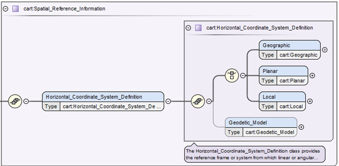

# Cartography (cart) Discipline Namespace User’s Guide

# [Contents](#contents)
1. [Introductory Resources](introductory)
1. [Overview](overview)
1. [Organization of Classes and Attributes](organization)
1. [Examples](examples)
   * [Transverse Mercator](transverse-mercator)
   * [Equirectangular](equirectangular)
   * See more on the [CART Wiki](https://github.com/pds-data-dictionaries/ldd-cart/wiki)
   * Conversion tutorials [CART Wiki](https://github.com/pds-data-dictionaries/ldd-cart/wiki)

# [Introductory Resources](#introductory)

- [CART Quick Introduction](../README.md) to the Cartography Dictionary
- [CART Detailed Guide](../docs)
- Using Local Dictionaries [SBN Wiki](https://sbnwiki.astro.umd.edu/wiki/Using_Local_Dictionaries)
- Schema Referencing in PDS4 Labels [SBN Wiki](https://sbnwiki.astro.umd.edu/wiki/Schema_Referencing_in_PDS4_Labels)
- Data Dictionary Creation [Resources](https://pds-data-dictionaries.github.io/getting-started/getting-started.html)

# [Overview of the Cartography Discipline Data Dictionary](#overview)

A map projection is generally a mathematical method used to represent the 3-dimensional surface of the target body on a 2-dimensional plane. This typically requires (1) definition for the shape and size of the body and (2) the ability to transform from geographic/geocentric (longitude and latitude) coordinates to planar/Cartesian coordinates (X, Y or also called eastings, northings) typically in meters. The various map projections allowed in PDS4 have different required parameter needs. For example, the Sinusoidal projection only has one required parameter to define the central meridian, called \<cart:longitude_of_central_meridian>. Whereas, the Equirectangular projection (also called Equidistant Cylindrical) requires both the \<cart:longitude_of_central_meridian> and the latitude of true scale or \<cart:standard_parallel_1>, which defines at what latitude where the scale is not distorted. Unfortunately, it is not uncommon for various applications to support a different number of parameters. Again for Equirectangular, some applications may also require the latitude of projection center or \<cart:latitude_of_projection_origin>. For our purposes we have defined this parameter as optional and implies this parameter should default to 0. Although it is optional, it is recommended that this parameter be explicitly set to zero. The equations used for the allowed map projections should be define in the archive’s Software Interface Specification (SIS). For the more typical cartographic projections, it is common to follow the methods (defined equations) as described in the 1987 USGS Professional Paper #1395, Map projections: A working manual by John P. Snyder (https://doi.org/10.3133/pp1395) or as supported within the open-source PROJ coordinate transformation software library (https://proj.org/) as sponsored by the Open Source Geospatial Foundation (OSGeo). Within the cartography XML schema, when available, the page number for the Snyder manual is listed (digital PDF is available from the link above) and the address to the PROJ specific map projection web page is made available.

And while related, landed and rings map projections can be very different. Currently we support seven different lander map projections commonly used in rover missions. Lander projections are commonly found or originate within JPL’s VICAR software. For rings, we currently only support one projection. This projection, called \<cart:Ring_Polar>, maps the distance from the center of the body in the X axis and the local time into the Y axis of the resulting Cartesian plane.
For context, the PDS4 cartography data dictionary replaces the original section found in PDS3 archives labeled OBJECT=IMAGE_MAP_PROJECTION. As previously stated, and based on the FGDC standard, the new hierarchical structure in PDS4 allows us to more easily group like sections. For example, to distinguish more typical map projections from landed or ring projections, we have divided available horizontal systems (Cartesian systems) into three categories, see Figure 2. The most used horizontal system will characteristically be \<cart:Planar>, where most widely-used cartographic map projections are defined. \<cart:Local> allows for landed and rings map projections. And lastly, \<cart:Geographic>, not originally allowed in PDS3, simply allows for the most basic of systems using distances provided in angular degrees.  


>_Figure 1. shows the \<cart:Horizontal_Coordinate_System_Definition> which requires one and only one type \<cart:Geographic>, \<cart:Planar>, or \<cart:Local>. While \<cart:Geodetic_Model>, which defines the size of the target body (e.g. radius of the body), may not always be required if the projection used is for a landed or rings projection._

# [Organization of Classes and Attributes](#organization)

As of version 1C00_1933, October 2019, for the cartography data dictionary, there are 58 classes and 154 attributes. That is far too many to describe each class and attribute within this document. Looking at the top-level schematic diagram in figure 2, it shows that to begin with the cartography dictionary is simply structured. While deeper into the structure it appears to be much more complicated, but the overall design remains relatively straight forward. The dictionary appears complicated as we currently support twelve cartographic-based map projection, seven lander-based map projections and one rings map projection. Because each of these map projections have often different required parameters, there are many needed attributes, thus the overall construction appears to be complicated.

For example, given a derived global image map, the cartography section needs to (1) when possible, identify the bounding coordinates in degrees, (2) define the horizontal type, size of the target body, and map projection type, (3) define the required attributes for that map projection, and (4) if the product is an image, define the mapping from the top-left pixel to the map projection’s Cartesian plane and the pixel’s cell size in meters.

For more see the CART [Detailed Guide](PDS4_CART_Detailed-Guide.md)

# [Examples](#examples)

### [Equirectangular PDS4 Cartography example](#equirectangular)
This example only shows the cartography section from a sample map projected (derived) observational data product. Note the two required sections (1) Spatial_Domain and (2) Spatial_Reference_Information (which includes Horizontal_Coordinate_System_Definition and Geodetic_Model).

```
...
   <cart:Cartography>
   <Local_Internal_Reference>
   <local_identifier_reference>image</local_identifier_reference>
   <local_reference_type>cartography_parameters_to_image_object</local_reference_type>
   </Local_Internal_Reference>
   <cart:Spatial_Domain>
   <cart:Bounding_Coordinates>
      <cart:west_bounding_coordinate unit="deg">75.8079050438213358</cart:west_bounding_coordinate>
      <cart:east_bounding_coordinate unit="deg">76.1736166611768368</cart:east_bounding_coordinate>
      <cart:north_bounding_coordinate unit="deg">20.4232179301976089</cart:north_bounding_coordinate>
      <cart:south_bounding_coordinate unit="deg">19.60712657606717</cart:south_bounding_coordinate>
   </cart:Bounding_Coordinates>
   </cart:Spatial_Domain>
   <cart:Spatial_Reference_Information>
   <cart:Horizontal_Coordinate_System_Definition>
      <cart:Planar>
      <cart:Map_Projection>
         <cart:map_projection_name>Equirectangular</cart:map_projection_name>
         <cart:Equirectangular>
         <cart:standard_parallel_1 unit="deg">20</cart:standard_parallel_1>
         <cart:longitude_of_central_meridian unit="deg">180</cart:longitude_of_central_meridian>
         <cart:latitude_of_projection_origin unit="deg">0</cart:latitude_of_projection_origin>
         </cart:Equirectangular>
      </cart:Map_Projection>
      <cart:Planar_Coordinate_Information>
         <cart:planar_coordinate_encoding_method>Coordinate Pair</cart:planar_coordinate_encoding_method>
         <cart:Coordinate_Representation>
         <cart:pixel_resolution_x unit="m/pixel">4</cart:pixel_resolution_x>
         <cart:pixel_resolution_y unit="m/pixel">4</cart:pixel_resolution_y>
         <cart:pixel_scale_x unit="pixel/deg">14808.3911670365142</cart:pixel_scale_x>
         <cart:pixel_scale_y unit="pixel/deg">14808.3911670365142</cart:pixel_scale_y>
         </cart:Coordinate_Representation>
      </cart:Planar_Coordinate_Information>
      <cart:Geo_Transformation>
         <cart:upperleft_corner_x unit="m">-5799472</cart:upperleft_corner_x>
         <cart:upperleft_corner_y unit="m">1209740</cart:upperleft_corner_y>
      </cart:Geo_Transformation>
      </cart:Planar>
      <cart:Geodetic_Model>
      <cart:latitude_type>Planetocentric</cart:latitude_type>
      <cart:spheroid_name>Mars</cart:spheroid_name>
      <cart:a_axis_radius unit="m">3393833.26099999994</cart:a_axis_radius>
      <cart:b_axis_radius unit="m">3393833.26099999994</cart:b_axis_radius>
      <cart:c_axis_radius unit="m">3393833.26099999994</cart:c_axis_radius>
      <cart:longitude_direction>Positive East</cart:longitude_direction>
      </cart:Geodetic_Model>
   </cart:Horizontal_Coordinate_System_Definition>
   </cart:Spatial_Reference_Information>
   </cart:Cartography>
...
```

### [Transverse Mercator PDS4 Cartography example](#transverse-mercator)
This example only shows the cartography section from a sample map projected (derived) observational data product. Note the two required sections (1) Spatial_Domain and (2) Spatial_Reference_Information (which includes Horizontal_Coordinate_System_Definition and Geodetic_Model).

```
...
   <cart:Cartography>
      <Local_Internal_Reference>
         <local_identifier_reference>image</local_identifier_reference>
         <local_reference_type>cartography_parameters_to_image_object</local_reference_type>
      </Local_Internal_Reference>
      <cart:Spatial_Domain>
         <cart:Bounding_Coordinates>
         <cart:west_bounding_coordinate unit="deg">-117.6411</cart:west_bounding_coordinate>
         <cart:east_bounding_coordinate unit="deg">-117.6281</cart:east_bounding_coordinate>
         <cart:north_bounding_coordinate unit="deg">33.90241</cart:north_bounding_coordinate>
         <cart:south_bounding_coordinate unit="deg">33.89153</cart:south_bounding_coordinate>
         </cart:Bounding_Coordinates>
      </cart:Spatial_Domain>
      <cart:Spatial_Reference_Information>
         <cart:Horizontal_Coordinate_System_Definition>
         <cart:Planar>
            <cart:Map_Projection>
               <cart:map_projection_name>Transverse Mercator</cart:map_projection_name>
               <cart:Transverse_Mercator>
               <cart:scale_factor_at_central_meridian>1.0</cart:scale_factor_at_central_meridian>
               <cart:longitude_of_central_meridian unit="deg">-117</cart:longitude_of_central_meridian>
               <cart:latitude_of_projection_origin unit="deg">0</cart:latitude_of_projection_origin>
               </cart:Transverse_Mercator>
            </cart:Map_Projection>
            <cart:Planar_Coordinate_Information>
               <cart:planar_coordinate_encoding_method>Coordinate Pair</cart:planar_coordinate_encoding_method>
               <cart:Coordinate_Representation>
               <cart:pixel_resolution_x unit="m/pixel">60</cart:pixel_resolution_x>
               <cart:pixel_resolution_y unit="m/pixel">60</cart:pixel_resolution_y>
               <cart:pixel_scale_x unit="pixel/deg">1855.345</cart:pixel_scale_x>
               <cart:pixel_scale_y unit="pixel/deg">1855.345</cart:pixel_scale_y>
               </cart:Coordinate_Representation>
            </cart:Planar_Coordinate_Information>
            <cart:Geo_Transformation>
               <cart:upperleft_corner_x unit="m">-59280.433</cart:upperleft_corner_x>
               <cart:upperleft_corner_y unit="m">3751320.543</cart:upperleft_corner_y>
            </cart:Geo_Transformation>
         </cart:Planar>
         <cart:Geodetic_Model>
            <cart:latitude_type>Planetocentric</cart:latitude_type>
            <cart:spheroid_name>Mars 2000 Sphere</cart:spheroid_name>
            <cart:a_axis_radius unit="m">3396190.0</cart:a_axis_radius>
            <cart:b_axis_radius unit="m">3396190.0</cart:b_axis_radius>
            <cart:c_axis_radius unit="m">3396190.0</cart:c_axis_radius>
            <cart:longitude_direction>Positive East</cart:longitude_direction>
         </cart:Geodetic_Model>
         </cart:Horizontal_Coordinate_System_Definition>
      </cart:Spatial_Reference_Information>
   </cart:Cartography>
...
```
